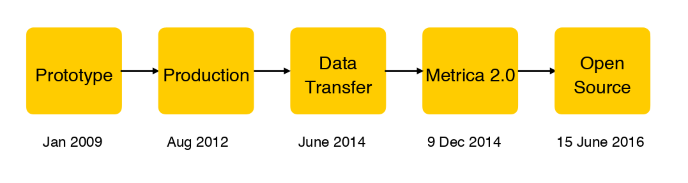
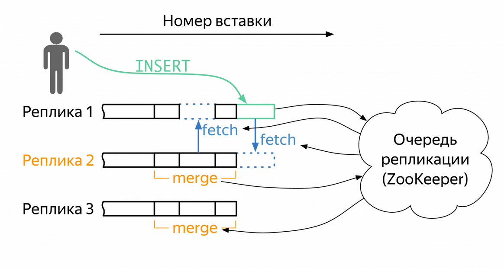
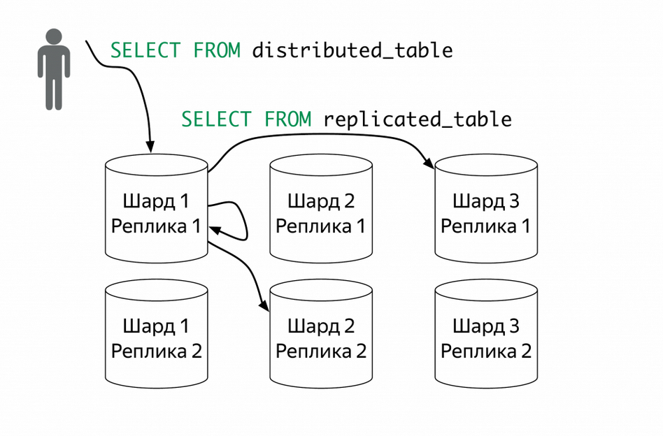
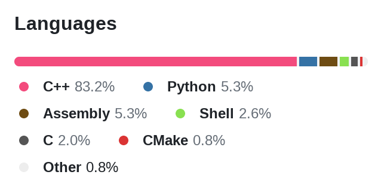
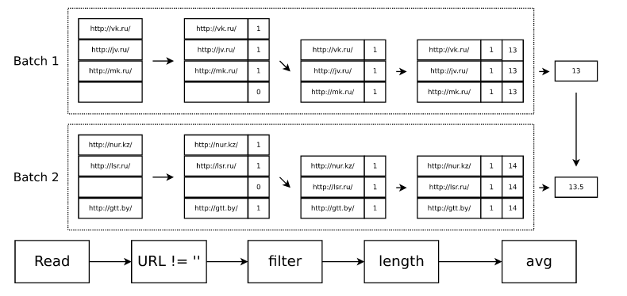
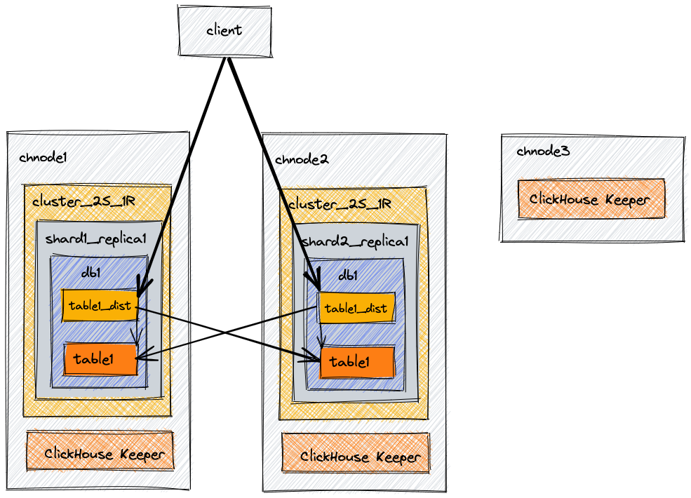
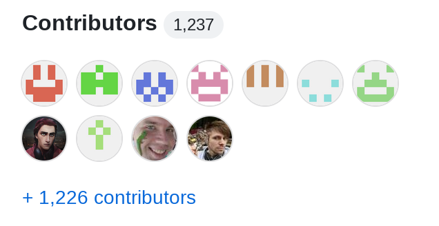

# ClickHouse

## 1. История развития СУБД
Колоночная аналитическая СУБД ClickHouse была разработана для решения задач веб-аналитики в Яндекс.Метрике.



Первый прототип ClickHouse появился в январе 2009 года. После трёх лет разработки, в 2012 году ClickHouse впервые был запущен в производство для работы с Яндекс.Метрикой. Развитая функциональность и наличие детальной документации привели к тому, что ClickHouse постепенно распространился по многим отделам Яндекса, включая Директ, Маркет и Почту[^1]. К концу 2014 года была запущена Метрика 2.0, работающая на базе ClickHouse. 15 июня 2016 года исходный код ClickHouse был выложен в открытый доступ на [Github](https://github.com/ClickHouse/ClickHouse) под лицензией Apache 2.0[^2]. С тех пор ClickHouse используется не только в Яндексе, но и во множестве других компаний и стартапов по всему миру, включая Cloudflare[^3], Disney+[^4] и Gitlab[^5].

[^1]: https://web.archive.org/web/20161021000715/https://www.percona.com/live/plam16/sessions/clickhouse-high-performance-distributed-dbms-analytics
[^2]: https://habr.com/ru/companies/yandex/articles/303282/
[^3]: https://blog.cloudflare.com/http-analytics-for-6m-requests-per-second-using-clickhouse/
[^4]: https://clickhouse.com/blog/nyc-meetup-report-high-speed-content-distribution-analytics-for-streaming-platforms
[^5]: https://about.gitlab.com/handbook/engineering/incubation/monitor-apm/

## 2. Инструменты для взаимодействия с СУБД
- Консольный клиент[^6]:
```bash
$ curl https://clickhouse.com/ | sh
$ ./clickhouse install
$ clickhouse-client --host <HOSTNAME> \
                    --secure \
                    --port 9440 \
                    --user <USERNAME> \
                    --password <PASSWORD>
```
- Сетевые API (HTTP, gRPC):
```bash
$ echo 'CREATE TABLE t (a UInt8) ENGINE = Memory' | curl 'http://localhost:8123/' --data-binary @-
```
- [ODBC](https://github.com/ClickHouse/clickhouse-odbc), [JDBC](https://github.com/ClickHouse/clickhouse-java)
- Официальные драйверы для [C++](https://github.com/ClickHouse/clickhouse-cpp), [Go](https://github.com/ClickHouse/clickhouse-go), [Python](https://github.com/ClickHouse/clickhouse-connect), [Java](https://github.com/ClickHouse/clickhouse-java), [JavaScript](https://github.com/ClickHouse/clickhouse-js). Пример взаимодействия с ClickHouse на языке Python[^7]:
```python
import clickhouse_connect

client = clickhouse_connect.get_client(host='localhost', username='default', password='password')
client.command('CREATE TABLE new_table (key UInt32, value String, metric Float64) ENGINE MergeTree ORDER BY key')

row1 = [1000, 'String Value 1000', 5.233]
row2 = [2000, 'String Value 2000', -107.04]
data = [row1, row2]
client.insert('new_table', data, column_names=['key', 'value', 'metric'])

result = client.query('SELECT max(key), avg(metric) FROM new_table')
```
- [Неофициальные клиентские библиотеки](https://clickhouse.com/docs/en/interfaces/third-party/client-libraries) для PHP, Swift, Perl, Ruby, Rust, R, Scala, Kotlin, C#, Elixir, Nim, Haskell
- [Неофициальные GUI-утилиты](https://clickhouse.com/docs/en/interfaces/third-party/gui)

[^6]: https://clickhouse.com/docs/en/interfaces/cli
[^7]: https://clickhouse.com/docs/en/integrations/python

## 3. Какой database engine используется в вашей СУБД?
В ClickHouse доступны следующие database engines[^8]:
- Atomic (используется по умолчанию)
```sql
CREATE DATABASE test [ENGINE = Atomic];
```
- Lazy: хранит таблицы в оперативной памяти только `expiration_time_in_seconds` секунд после последнего доступа.
```sql
CREATE DATABASE testlazy ENGINE = Lazy(expiration_time_in_seconds);
```
- Replicated: основан на Atomic. Поддерживает репликацию метаданных через журнал DDL, который записывается в ZooKeeper и выполняется на всех репликах для данной базы данных.
```sql
CREATE DATABASE testdb ENGINE = Replicated('zoo_path', 'shard_name', 'replica_name');
```
- PostgreSQL: позволяет подключаться к базам данных на удаленном PostgreSQL сервере.
```sql
CREATE DATABASE test_database ENGINE = PostgreSQL('host:port', 'database', 'user', 'password'[, `schema`, `use_table_cache`]);
```
- MySQL: позволяет подключаться к базам данных на удаленном MySQL сервере.
```sql
CREATE DATABASE [IF NOT EXISTS] db_name [ON CLUSTER cluster] ENGINE = MySQL('host:port', ['database' | database], 'user', 'password');
```
- SQLite: позволяет подключаться к SQLite базе данных.
```sql
CREATE DATABASE sqlite_database ENGINE = SQLite('db_path');
```

[^8]: https://clickhouse.com/docs/en/engines/database-engines

## 4. Как устроен язык запросов в вашей СУБД? Разверните БД с данными и выполните ряд запросов.
ClickHouse поддерживает декларативный язык запросов на основе SQL, который во многих случаях идентичен стандарту ANSI SQL. Поддерживаемые запросы включают GROUP BY, ORDER BY, JOIN, подзапросы в FROM, оператор IN и оконные функции.

Для примеров запросов см. директорию [code](code).

## 5. Возможно ли распределение файлов БД по разным носителям?
В ClickHouse поддерживаются репликация и шардирование. Про шардирование подробнее см. [пункт 12](#12-расскажите-про-шардинг-в-вашей-конкретной-субд-какие-типы-используются-принцип-работы).

С точки зрения CAP-теоремы[^9]:
- Consistency - нет (асинхронная репликация)
- Availability - есть (но нельзя писать на сервер, отрезанный от кворума)

Репликация | Репликация + Шардирование
:-:|:-:
 | 

## 6. На каком языке/ах программирования написана СУБД?
ClickHouse написан на языке C++ (используется стандарт [C++23](https://github.com/ClickHouse/ClickHouse/blob/master/CMakeLists.txt#L275)).



[^9]: https://habr.com/ru/articles/509540/

## 7. Какие типы индексов поддерживаются в БД? Приведите пример создания индексов.
В ClickHouse поддерживаются как простые, так и композитные индексы. ClickHouse создаёт sparse primary index по primary ключу. Также можно создать дополнительные skip индексы. Объявить индексы можно в запросе `CREATE`:
```sql
CREATE TABLE table_name
(
    u64 UInt64,
    i32 Int32,
    s String,
    ...
    INDEX idx1 u64 TYPE bloom_filter GRANULARITY 3,
    INDEX idx2 u64 * i32 TYPE minmax GRANULARITY 3,
    INDEX idx3 u64 * length(s) TYPE set(1000) GRANULARITY 4
) ENGINE = MergeTree();
```
Пример использования skip индекса[^10]:
```sql
CREATE TABLE skip_table
(
  my_key UInt64,
  my_value UInt64
)
ENGINE MergeTree primary key my_key
SETTINGS index_granularity=8192;

INSERT INTO skip_table SELECT number, intDiv(number,4096) FROM numbers(100000000);

-- Создаём простой индекс:
ALTER TABLE skip_table ADD INDEX vix my_value TYPE set(100) GRANULARITY 2;

-- Для индексирования уже существующих данных:
ALTER TABLE skip_table MATERIALIZE INDEX vix;
```
Результат работы запроса `
SELECT * FROM skip_table WHERE my_value IN (125, 700)`:
```
┌─my_key─┬─my_value─┐
│ 512000 │      125 │
│ 512001 │      125 │
│    ... |      ... |
└────────┴──────────┘

8192 rows in set. Elapsed: 0.051 sec. Processed 32.77 thousand rows, 360.45 KB (643.75 thousand rows/s., 7.08 MB/s.)
```
Иллюстрация того, как 4096 строк со значением my_value 125 были прочитаны и выбраны, а следующие строки были пропущены без чтения с диска:


[^10]: https://clickhouse.com/docs/en/optimize/skipping-indexes

## 8. Как строится процесс выполнения запросов в вашей СУБД?
В ClickHouse в качестве processing model применяется vectorization model[^11]:



[^11]: https://presentations.clickhouse.com/meetup24/5.%20Clickhouse%20query%20execution%20pipeline%20changes/#pipeline-execution-logistics-4

## 9. Есть ли для вашей СУБД понятие «план запросов»? Если да, объясните, как работает данный этап.
Да, план запроса можно посмотреть с помощью `EXPLAIN`:
```sql
EXPLAIN [AST | SYNTAX | QUERY TREE | PLAN | PIPELINE | ESTIMATE | TABLE OVERRIDE] [setting = value, ...]
    [
      SELECT ... |
      tableFunction(...) [COLUMNS (...)] [ORDER BY ...] [PARTITION BY ...] [PRIMARY KEY] [SAMPLE BY ...] [TTL ...]
    ]
    [FORMAT ...]
```
Пример[^12]:
```sql
EXPLAIN SELECT sum(number) FROM numbers(10) UNION ALL SELECT sum(number) FROM numbers(10) ORDER BY sum(number) ASC FORMAT TSV;
```
```
Union
  Expression (Projection)
    Expression (Before ORDER BY and SELECT)
      Aggregating
        Expression (Before GROUP BY)
          SettingQuotaAndLimits (Set limits and quota after reading from storage)
            ReadFromStorage (SystemNumbers)
  Expression (Projection)
    MergingSorted (Merge sorted streams for ORDER BY)
      MergeSorting (Merge sorted blocks for ORDER BY)
        PartialSorting (Sort each block for ORDER BY)
          Expression (Before ORDER BY and SELECT)
            Aggregating
              Expression (Before GROUP BY)
                SettingQuotaAndLimits (Set limits and quota after reading from storage)
                  ReadFromStorage (SystemNumbers)
```

[^12]: https://clickhouse.com/docs/en/sql-reference/statements/explain

## 10. Поддерживаются ли транзакции в вашей СУБД? Если да, то расскажите о нем. Если нет, то существует ли альтернатива?
Транзакции поддерживаются в экспериментальном режиме[^13]:
- Работают только для нереплицированной базы данных
- Вложенные транзакции не поддерживаются
```sql
BEGIN TRANSACTION;
INSERT INTO mergetree_table FORMAT Values (42);
COMMIT;
```

[^13]: https://clickhouse.com/docs/en/guides/developer/transactional

## 11. Какие методы восстановления поддерживаются в вашей СУБД. Расскажите о них.
В ClickHouse поддерживается механизм инкрементальных бэкапов[^14]. Бэкапы можно хранить локально и на S3.
```sql
 BACKUP|RESTORE
  TABLE [db.]table_name [AS [db.]table_name_in_backup]
    [PARTITION[S] partition_expr [,...]] |
  DICTIONARY [db.]dictionary_name [AS [db.]name_in_backup] |
  DATABASE database_name [AS database_name_in_backup]
    [EXCEPT TABLES ...] |
  TEMPORARY TABLE table_name [AS table_name_in_backup] |
  VIEW view_name [AS view_name_in_backup]
  ALL TEMPORARY TABLES [EXCEPT ...] |
  ALL DATABASES [EXCEPT ...] } [,...]
  [ON CLUSTER 'cluster_name']
  TO|FROM File('<path>/<filename>') | Disk('<disk_name>', '<path>/') | S3('<S3 endpoint>/<path>', '<Access key ID>', '<Secret access key>')
  [SETTINGS base_backup = File('<path>/<filename>') | Disk(...) | S3('<S3 endpoint>/<path>', '<Access key ID>', '<Secret access key>')]
```

[^14]: https://clickhouse.com/docs/en/operations/backup

## 12. Расскажите про шардинг в вашей конкретной СУБД. Какие типы используются? Принцип работы.
Для координации узлов можно использовать ClickHouse Keeper. В отличие от ZooKeeper, ClickHouse Keeper использует алгоритм консенсуса RAFT[^15].



| Узел    | Описание                        |
|---------|---------------------------------|
| chnode1 | Данные + ClickHouse Keeper      |
| chnode2 | Данные + ClickHouse Keeper      |
| chnode3 | ClickHouse Keeper (для кворума) |

[^15]: https://clickhouse.com/docs/en/architecture/horizontal-scaling

## 13. Возможно ли применить термины Data Mining, Data Warehousing и OLAP в вашей СУБД?
ClickHouse - колоночная СУБД, спроектированная специально для OLAP, позволяющая в режиме реального времени строить аналитические отчёты по огромным массивам данных. ClickHouse отлично подходит для задач data mining'а и data warehousing'а.

## 14. Какие методы защиты поддерживаются вашей СУБД? Шифрование трафика, модели авторизации и т.п.
В ClickHouse можно настроить LDAP для аутентификации пользователей базы данных. Для валидации подключений к ClickHouse и шифрования трафика можно использовать OpenSSL.

ClickHouse поддерживает управление доступом на основе ролей. Пример:
```sql
CREATE USER mira IDENTIFIED WITH sha256_password BY 'my_password'

CREATE ROLE accountant;
GRANT SELECT ON db.* TO accountant;
GRANT accountant TO mira;
```

## 15. Какие сообщества развивают данную СУБД? Кто в проекте имеет права на коммит и создание дистрибутива версий? Расскажите об этих людей и/или компаниях.
В ClickHouse могут контирбьютить все желающие[^16].



Юридический владелец проекта - стартап ClickHouse, Inc. Список разработчиков можно найти [здесь](https://github.com/orgs/ClickHouse/people). Co-founder и CTO - [Алексей Миловидов](https://github.com/alexey-milovidov).

[^16]: https://github.com/ClickHouse/ClickHouse/blob/master/CONTRIBUTING.md

## 16. Создайте свои собственные данные для демонстрации работы СУБД.
См. директорию [code](code).

## 17. Как продолжить самостоятельное изучение языка запросов с помощью демобазы? Если демобазы нет, то создайте ее.
См. директорию [code](code).

## 18. Где найти документацию и пройти обучение?
- Официальная документация: https://clickhouse.com/docs
- Туториалы из документации: [Quick start](https://clickhouse.com/docs/en/getting-started/quick-start), [Advanced tutorial](https://clickhouse.com/docs/en/tutorial)
- Официальные обучающие курсы: https://clickhouse.com/learn

## 19. Как быть в курсе происходящего?
- Официальный блог: https://clickhouse.com/blog
- Официальный YouTube канал: https://www.youtube.com/@ClickHouseDB
- Официальный Twitter аккаунт: https://twitter.com/clickhousedb
